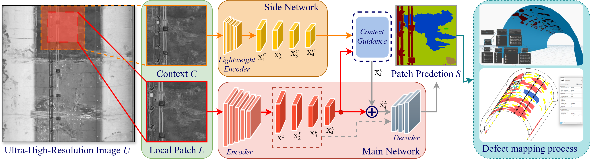

# As-Damaged Tunnel Digital Model Generation via Panoptic Segmentation of Ultra-High-Resolution Images

This repository contains the official implementation for the paper:  
**"As-damaged Tunnel Digital Model Generation via Panoptic Segmentation of Ultra-High-Resolution Images."**

---

## 📘 Overview

Ultra-high-resolution (UHR) panoramic imaging provides detailed tunnel surface documentation, but damage identification in such imagery still largely depends on manual inspection. Automated methods often struggle to efficiently process UHR data, limiting the effective use of high-fidelity tunnel information.

To address this challenge, we propose a **novel framework** that directly operates on **UHR panoramic images** for:

- Automated **damage detection**  
- **Structural documentation**  
- **Risk assessment**  
- **3D reconstruction** as an **as-damaged BIM (Building Information Modelling)** model with annotated defects  

At its core lies a **flexible panoptic segmentation architecture** that integrates:
- A **side network** for context extraction from larger image patches  
- Support for **images exceeding 6K resolution**  
- Accurate detection of **tunnel components** and **five main damage types**

By incorporating the **Segment Anything Model 2 (SAM2)** backbone, our framework achieves a significant performance boost, raising **Panoptic Quality (PQ)** from **53.14** to **56.99**.

The resulting as-damaged BIM model provides efficient recording, visualization, and risk-level representation — substantially enhancing the automation and efficiency of tunnel monitoring and management workflows.

  

  <em>Figure 1. Overview of the proposed framework for tunnel panoptic segmentation and as-damaged BIM generation.</em>

---

## ⚙️ Repository Structure and Key Modifications

This implementation is built upon the **[MMDetection](https://github.com/open-mmlab/mmdetection)** framework, with several key extensions and modifications tailored for UHR tunnel image analysis:

### 🧩 Core Modifications

| File / Module | Description |
|----------------|-------------|
| **`transforms/`** | Added **context data preprocessing** for extracting and integrating multi-scale contextual information from large image patches. |
| **`detectors/maskformer.py`** | Integrated **EfficientViTBackbone**, added **context-passing modules**, and implemented **chunk-based inference** for handling ultra-large images efficiently. |
| **`detectors/mask2former.py`** | Introduced an additional **context parameter input** for enhanced contextual awareness during segmentation. |
| **`detectors/`** | Added the full **EfficientViT** implementation for lightweight yet effective feature extraction. |
| **`backbones/`** | Integrated **Segment Anything Model 2 (SAM2)** backbone to improve segmentation precision and robustness. |

---

## 🚀 Features

- Direct processing of **ultra-high-resolution (UHR)** panoramic tunnel images  
- **Context-aware segmentation** via multi-scale context fusion  
- Support for **EfficientViT** and **SAM2** backbones  
- **Chunk-based inference** for large-scale image handling  
- Generation of **as-damaged BIM models** with annotated defects  
- Improved **panoptic segmentation performance (PQ +3.85)**  

---

## 📝 As-damaged Tunnel BIM Model Generation

- Include both things and stuff (simple projection in this case) in ./As-damaged BIM
- 3D point projection (in Jupyter Notebook)
- BIM element (IFC foramt) generation includes two approach:
  - processed by Dynamo and import to Reivt and then output IFC format
  - generated in pure Python environment (PyVista + IFCOpenshell)

---

## 📊 Progress

15th Oct, 2025: Code release
